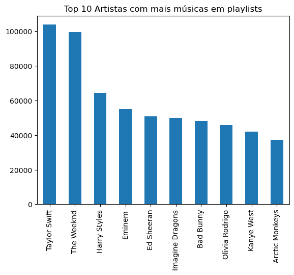
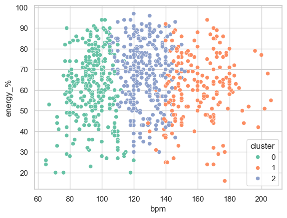
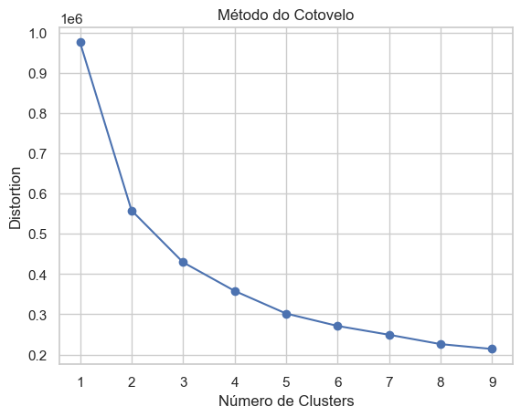
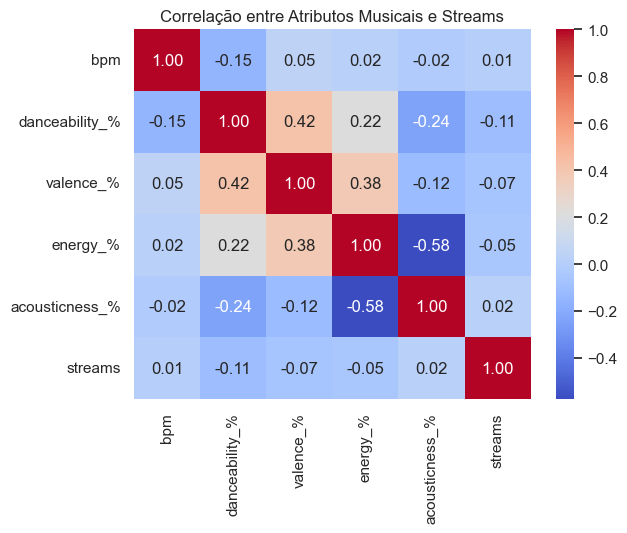
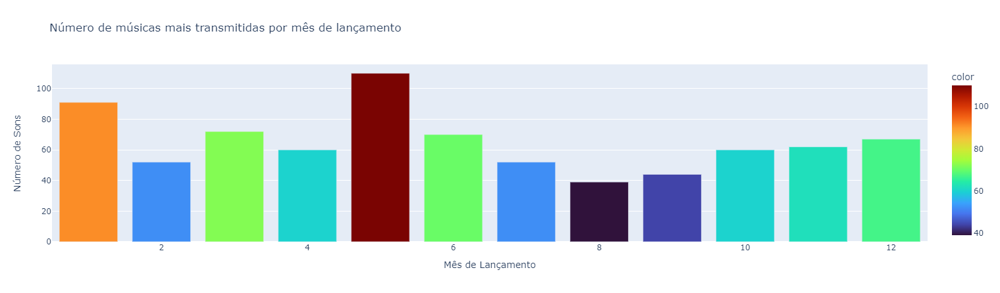
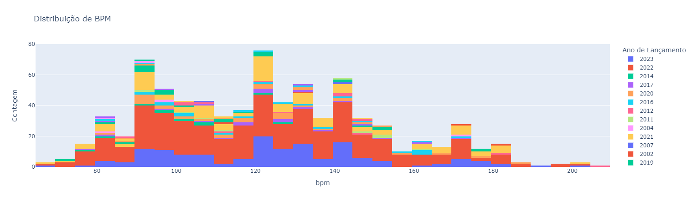
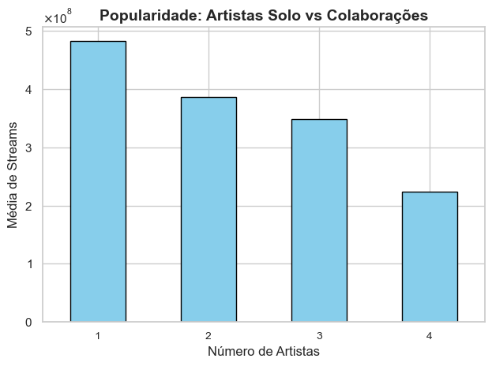
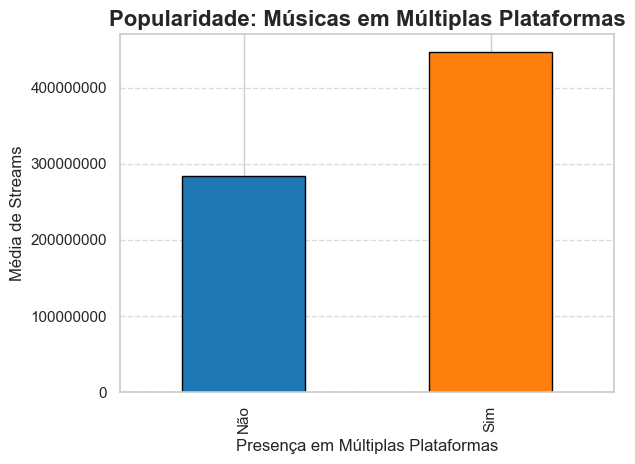

# Estudo em Python Sobre Dados de Streaming Musical

Este repositório contém meu estudo e análises sobre dados de streaming musical, obtidos no Kaggle, utilizando estatística e programação em Python. O objetivo é aprofundar meus conhecimentos em análise de dados, modelagem preditiva e técnicas de programação aplicadas ao universo musical, explorando insights valiosos sobre tendências, popularidade e padrões de consumo.

📊 Objetivos do Estudo
O estudo tem como propósito aplicar e desenvolver diversas metodologias estatísticas e técnicas de machine learning. Entre os principais objetivos, estão:

Análise de Tendências Musicais: Investigar como atributos musicais evoluem ao longo do tempo.
Correlação entre Atributos e Popularidade: Identificar variáveis que influenciam o número de streams.
Análise de Clusters: Agrupamento de músicas com base em suas características, facilitando a segmentação de público e recomendações personalizadas.
Comparação de Popularidade em Diferentes Plataformas: Explorar os padrões de consumo em Spotify, Apple Music, Deezer e Shazam.

📚 Conhecimentos Aplicados
Ao longo do estudo, aprofundei meus conhecimentos nas seguintes áreas:

Estatística Descritiva: Compreensão dos principais atributos musicais.
Modelagem Estatística: Implementação de algoritmos como K-Means para clustering.
Visualização de Dados: Criação de gráficos interativos e intuitivos para comunicar insights.
Tratamento e Limpeza de Dados: Manipulação de dados, detecção e correção de valores ausentes e formatações inadequadas.
Programação em Python: Desenvolvimento de soluções modulares e eficientes para análise de grandes volumes de dados.

🛠️ Ferramentas Utilizadas
Algumas das bibliotecas e ferramentas aplicadas durante este estudo incluem:

Python: Linguagem principal para as análises.
Pandas: Manipulação de dados tabulares.
NumPy: Operações numéricas.
Matplotlib & Seaborn: Visualização de dados.
Scikit-learn: Algoritmos de machine learning.
Plotly: Visualização de dados interativa.

🔍 Principais Análises

# 🎤 Quais são os artistas com mais músicas em playlists? 

- 📌 Considerações

Taylor Swift e The Weeknd lideram em número de músicas presentes em playlists. Harry Styles, Eminem, Ed Sheeran, e outros grandes nomes seguem com destaque.

- 💡 Insight

A análise revela a dominância de alguns artistas em playlists, sugerindo que a popularidade e presença desses artistas nas plataformas de streaming podem ser usados para impulsionar campanhas e maximizar a visibilidade de lançamentos futuros.

# 🎧 Como podemos agrupar músicas com características semelhantes para criar playlists personalizadas, recomendar conteúdos ou segmentar o público de forma mais eficiente?

- 📌 Considerações

O gráfico de dispersão exibe o resultado do algoritmo K-Means, segmentando as músicas em três clusters com base no BPM e nível de energia.

- 💡 Insight

Através dessa análise podemos recomendar playlists personalizadas ou segmentar o público com base em preferências musicais específicas, como músicas rápidas e energéticas (Cluster 2) ou mais lentas e moderadas (Cluster 0).

# Gráfico do Cotovelo

Ao utilizar o gráfico do cotovelo, foi possível identificar que três clusters (n = 3) são suficientes para capturar as variações nos dados de forma eficiente, sem introduzir complexidade desnecessária ao modelo.

# 🎼 Quais atributos musicais (ex: BPM, energia, dançabilidade) estão mais correlacionados com o sucesso (número de streams)?

- 📌 Observação

O mapa de calor exibe as correlações entre atributos musicais como BPM, energia e dançabilidade, e o número de streams.

- 💡 Insight

Músicas com maior dançabilidade tendem a ter valence (felicidade) mais altos. A correlação entre atributos musicais e sucesso (streams) é baixa, sugerindo que outros fatores, como marketing e promoção em playlists, são mais determinantes para o sucesso de uma música.

# 📅 Quais tendências podem ser observadas em relação aos meses de lançamento das músicas mais transmitidas?

- 📌 Observação

Os meses de março e maio têm o maior número de músicas populares lançadas, enquanto fevereiro e setembro possuem o menor volume de lançamentos de sucesso.

- 💡 Insight

Identificar picos de lançamento pode ajudar na escolha de melhores datas para novas músicas ou campanhas promocionais, maximizando o impacto nos streams.

# 🎶 Qual a distribuição de BPM nas músicas de sucesso, e qual faixa de BPM está mais associada ao sucesso?

- 📌 Observação

A maior parte das músicas populares concentra-se na faixa de 80 a 140 BPM. Músicas recentes (2022-2023) dominam a distribuição.

- 💡 Insight

Essa faixa de BPM é amplamente associada a músicas dançantes e populares, sendo comum para hits atuais.

# 🤝 Os artistas solo estão dominando o mercado? | As colaborações estão prejudicando a popularidade?

- 📌 Observação

Músicas com um único artista possuem a maior média de streams, seguidas de colaborações com dois artistas. À medida que o número de artistas aumenta, a média de streams diminui.

- 💡 Insight

Colaborações com muitos artistas são menos comuns, mas podem atrair grandes audiências em casos específicos. No entanto, artistas solo dominam em termos de popularidade.

# 📱 Músicas presentes em várias plataformas (Spotify, Apple Music, Deezer) têm melhor desempenho em termos de streams?

- 📌 Observação

Músicas disponíveis em várias plataformas (Spotify, Apple Music, Deezer) tendem a ter uma média de streams maior.

- 💡 Insight

Distribuir músicas em múltiplas plataformas amplia a visibilidade, porém músicas exclusivas em poucas plataformas podem gerar mais engajamento.

⏳ Próximos Passos

Explorar outros algoritmos de machine learning, como Gradient Boosting e Support Vector Machines.
Ampliar as análises com dados sobre preferências de usuários e padrões de consumo em plataformas de streaming.
Implementar análises de séries temporais para prever tendências futuras de popularidade musical.

✨ Conclusão

Este repositório reflete meu esforço contínuo em aprimorar minhas habilidades em estatística e ciência de dados, aplicando técnicas avançadas em um contexto prático de análise de dados musicais. Sinta-se à vontade para explorar, fazer perguntas ou contribuir com o projeto!